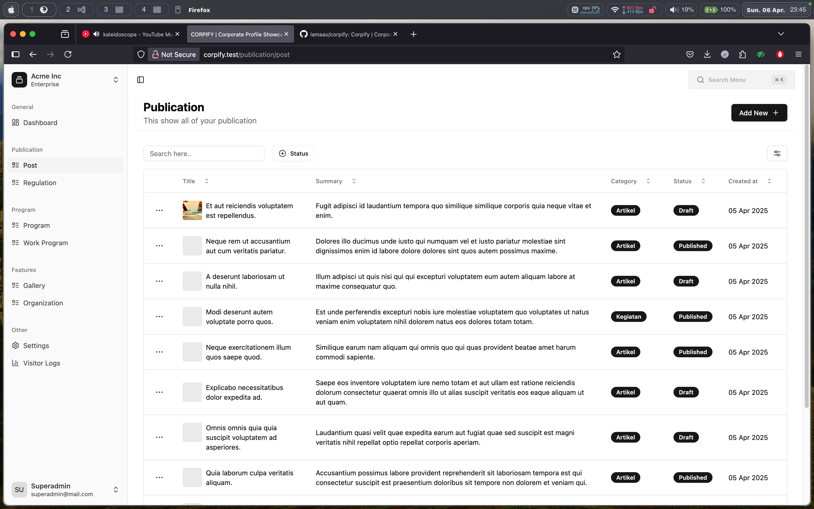
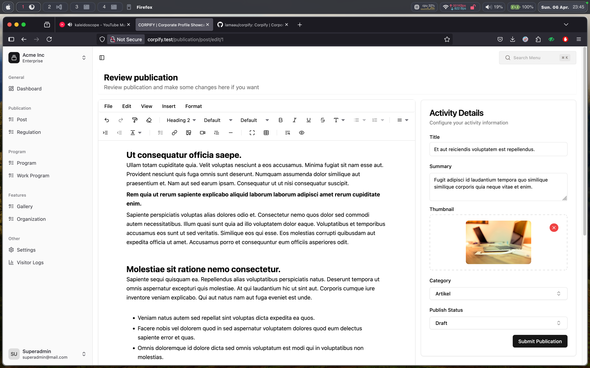
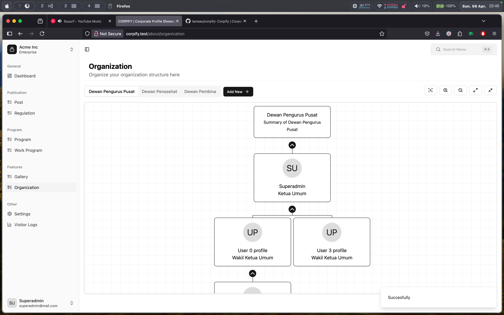
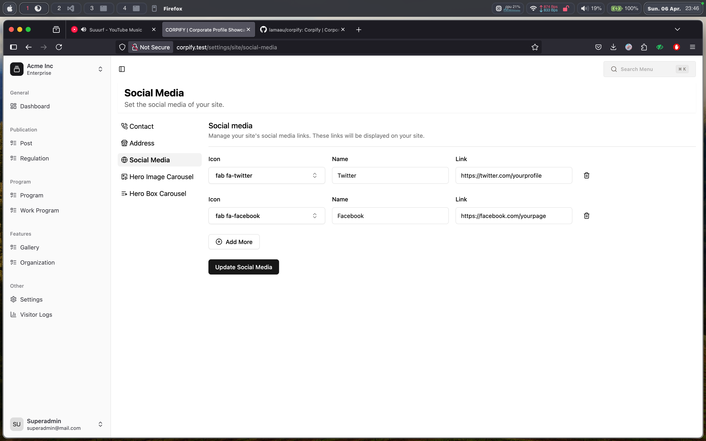

# 🏢 Corpify

**Corpify** is an open-source Company Profile application built using **Laravel (API only)** and **Vue 3** for the frontend. It helps businesses present their identity and services in a modern, responsive, and customizable way.

> _Your Company, Beautifully Presented._

---

## 📌 Features

- Full RESTful API backend (Laravel)
- Vue 3 Typescript
- About Us, Services, Team, Gallery, and Contact sections
- Responsive and mobile-friendly design
- Authentication & Role Management
- Open source and easy to extend

---

## 🛠 Tech Stack

### Backend

- [Laravel 10.x](https://laravel.com)
- [Laravel Sanctum](https://laravel.com/docs/sanctum) - API Auth
- MySQL / PostgreSQL

### Frontend

- [Vue 3](https://vuejs.org)
- [Vue Router](https://router.vuejs.org)
- [TailwindCSS](https://tailwindcss.com/)
- [ShadcnUI](https://www.shadcn-vue.com/)
- [TanStack](https://tanstack.com/query/latest) - For Table and Query

### Screenshot

